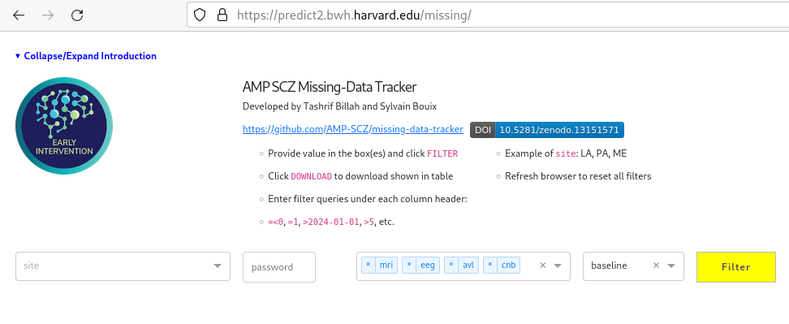

# missing-data-tracker

[](https://doi.org/10.5281/zenodo.13151571) []() []()

A web application for tracking AMP-SCZ missing data

Tashrif Billah and Sylvain Bouix

### Table of Contents

* [Description](#description)
* [Nginx config](#nginx-config)
* [ERIS to VM rsync](#eris-to-vm-rsync)

---

### Description

https://predict2.bwh.harvard.edu/missing/ is a web application for tracking AMP-SCZ data e.g. arrival, protocol deviation, and QC ratings. It has site-specific and network-specific logins allowing decentralized access to AMP-SCZ data.



The application's backend is designed intelligently to allow front-end data manipulation such as filtering, sorting, selective rendering of columns. Moreover, users can filter for data types: MRI, EEG, CNB, and A/V/L and timepoints: baseline, month_2, month_6, etc:


Each page of the web application shows 50 subjects with option to change page. This pagination facilitates easier navigation over hundreds of subjects. Finally, it has a download feature to save the filtered data as a spreadsheet. The spreadsheet could be sent to stakeholder site so that they can correct any anomalies that are present.


### Nginx config

To access the web app at https://NAME.harvard.edu/missing , add this snippet to `/etc/nginx/nginx.conf`:

```
    location /missing/ {
        proxy_pass http://localhost:8052;
    }
```


### ERIS to VM rsync

```
cd /data/predict1/data_from_nda/
rsync -aR combined-AMPSCZ-data_*-day1to1.csv rc-predict-dev.partners.org:/data/predict1/data_from_nda/
rsync -aR Pronet_status/combined-*csv rc-predict-dev.partners.org:/data/predict1/data_from_nda/
rsync -aR Prescient_status/combined-*csv rc-predict-dev.partners.org:/data/predict1/data_from_nda/
```


